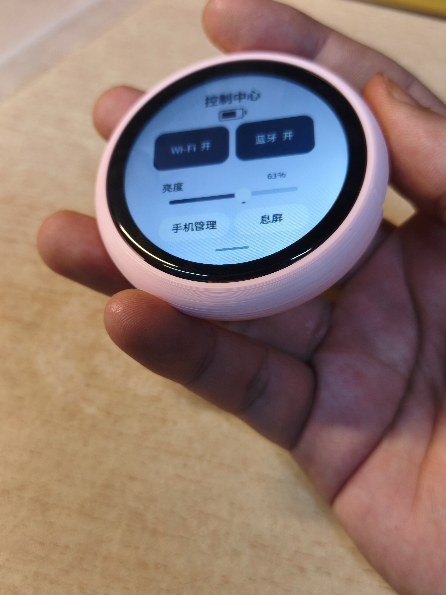
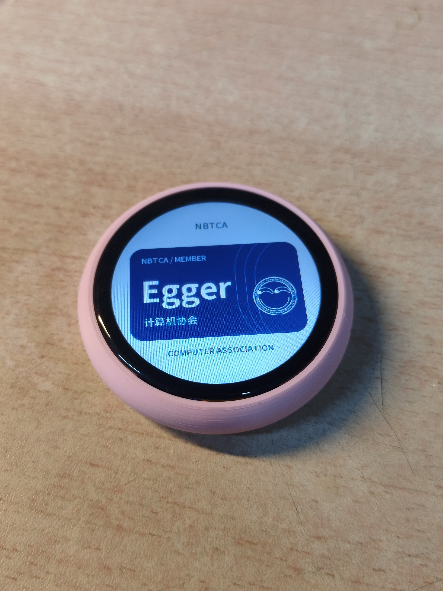
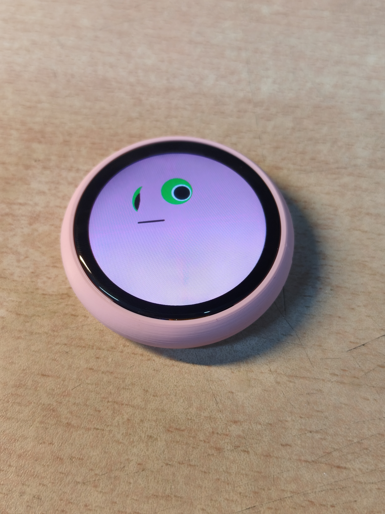

# CABadge V6 外壳打印文件

2026-09-30 实物试装版本。用户反馈：**“总体可以的，有些细节有瑕疵。”** 保留当次打印文件，不是消除全部瑕疵后的定版。

## 三个打印模型

- [上壳 V6_Upper.STL](V6_Upper.STL)
- [下壳 V6_Lower.STL](V6_Lower.STL)
- [电源拨片 V6_Slider.STL](V6_Slider.STL)

三个模型合计323252字节（约316 KiB）。单位mm，切片保持100%比例。不上传SW装配、PCB参考件或其他模型。

名义最大外径62mm、总高13.9mm，中段外鼓，两片壳体胶粘。叠层为屏幕—42×30×4mm电池—PCB，元件朝屏幕；不装电池座，两根线直接焊接。BOOT/RESET不留外部孔。这些是设计参数，不是照片实测。

## 已知装配注意

原上壳拨片外侧宽凹槽底部两侧各有约0.4mm薄挡边，CAD复核发现会阻挡装入。若拨片装不进去，仅将这两处薄边修通至下沿，不剪内导轨或拨片限位片；对空壳少量修整并去毛刺，不带着屏幕、电池剪。用户曾表示必要时修剪，但未明确反馈是否已剪。

先干装：屏幕FPC先穿过上壳并接好，整理绝缘片、电池及内部走线；**拨片先从外侧套到开关柄，再将上壳罩下**，最后屏幕落在背胶承托台阶。封胶前确认USB线插到底、开关两端到位、线不夹缝、电池不受压。

## 用户实物照片

照片展示打印外壳及装入点亮的屏幕，不单独证明内部无顶压、USB/拨片全功能或长期使用通过。具体瑕疵尚待反馈。

`SHA256SUMS.txt`用于校验3个STL及3张原照片的下载完整性，不代表实物验收。本次不修改PCB或固件。
