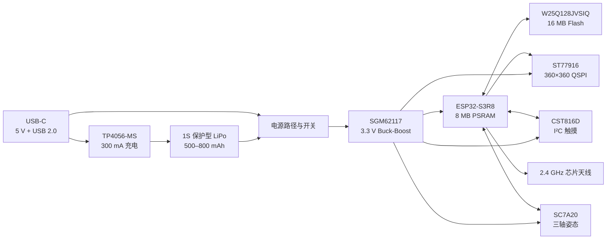

> 历史设计/阶段记录：保留当时版本、方案和测量值，不作为当前安装或验收说明。当前正式版为 v1.1.0 / 7.9.2-memory，参见[文档索引](docs/INDEX.md)。

# 计协电子吧唧开发计划书

**版本：** V1.0  
**日期：** 2026-09-08  
**目标：** 以 1.8 英寸圆形触摸屏为正面，开发一款体积小、结构简单、可单面贴装、成本约 100 元的计协电子吧唧，并形成可直接用于后续原理图、PCB 与结构设计的硬件基线。

## 1. 项目定位

产品正面是一块完整的圆形屏幕，显示计协 Logo、成员身份、动态图片或 GIF；通过触摸切换内容，通过蓝牙更新素材，晃动或翻转时可触发动画。USB-C 同时承担充电、固件下载和调试。

参考项目[《基于 ESP32-S3 的电子吧唧》](https://oshwhub.com/loudlin/dzbj)已经证明“ESP32-S3 + 圆形触摸屏 + 蓝牙传图”的方向可行，其公开说明给出的复刻成本约为 100 元。本项目只参考其功能架构、屏幕接口和已验证经验，重新完成适合计协周边的原理图、PCB、结构与视觉设计。

V1 只保留以下功能：

- 360×360 圆形彩屏显示；
- 单点电容触摸；
- 蓝牙低功耗通信，后续固件实现手机传图；
- USB-C 充电、下载和调试；
- 500–800 mAh 单节锂聚合物电池供电；
- 三轴姿态感应，用于抬腕、翻转、摇一摇等交互；
- 外置 16 MB Flash，用于程序和图片素材；
- BOOT、RESET 和电源开关。

V1 不放置扬声器、麦克风、功放、振动马达、温湿度传感器、MicroSD 卡、USB 转串口芯片、外置 32.768 kHz 晶振和装饰 RGB 灯。这些功能会增加面积、厚度、成本、焊接面和固件工作量，而不影响电子吧唧的核心体验。若后续确实需要大量视频素材，再增加 MicroSD；若需要语音功能，再单独做音频版本。

## 2. 已锁定的屏幕和外形

屏幕按用户提供的 `W180TE010I-18Z(CTP-A1)` 资料设计。关键参数如下：

| 项目 | 锁定值 | 设计影响 |
|---|---:|---|
| 显示尺寸 | 1.8 英寸圆形 | 正面由屏幕盖板构成 |
| 分辨率 | 360(RGB)×360，282 PPI | 适合 Logo、头像和短动画 |
| 显示驱动 | ST77916 | 使用 QSPI，减少主控引脚和走线 |
| 触摸驱动 | CST816D，单点 I²C，7 位地址 0x15 | 与姿态传感器共用 I²C 总线 |
| 可视区域 | Ø45.684 mm | UI 的文字和 Logo 应放在中央安全区 |
| 触摸显示总成 | Ø53.0 mm × 3.7 mm | 产品正面最终直径基准 |
| 屏幕接口 | 18 Pin、0.5 mm 间距 ZIF | 使用下接式卧贴连接器 |
| 显示供电 | 2.8/3.3 V | V1 统一使用 3.3 V |
| 背光 | 3 颗白光 LED 并联，单颗典型 20 mA | 满亮约 60 mA，必须支持 PWM 调光 |

本方案的机械基线为：

- **产品正面直径：Ø53.0 mm**，与屏幕盖板一致；
- **PCB：Ø50.0 mm，1.0 mm 厚，4 层板**；PCB 每侧比屏幕缩进 1.5 mm，避免板边因加工公差露出，同时给外壳卡边和屏幕胶留空间；
- **后壳最大直径：Ø52.8 mm**，从正面看不超出屏幕；
- **整机目标厚度：13–15 mm**，包括屏幕 3.7 mm、PCB、元件、电池、绝缘和后壳；
- **元器件全部放在 PCB 的同一面**，该面在装机后朝向后壳；朝屏幕的一面不放器件；
- 屏幕用 0.3–0.5 mm 黑色双面胶或定制环形胶固定，FPC 向后折入连接器；
- 后壳集成别针或磁吸背夹，受力结构由外壳承担，不让屏幕、FPC 或电池承受佩戴拉力。

PCB 不做成 Ø53 mm，是为了保证任何制造公差下都不会从圆形盖板边缘露出。整机正面仍严格保持屏幕的 Ø53 mm 外形。

## 3. 硬件总体架构

电源路径采用：`USB 5V / 电池 → 基础负载分配 → SGM62117 → 3.3V`。电源开关控制 SGM62117 的 EN，关机时充电芯片仍可工作。这样单节锂电从约 4.2 V 放到低电量区间时，主电源都能保持 3.3 V，不沿用只适合降压的 SGM6036。SGM62117 官方给出的输入范围为 2.2–5.5 V，3.3 V 输出条件下可提供最高 2 A，余量足够覆盖 ESP32-S3 的射频瞬时电流、屏幕和背光。

## 4. V1 硬件选型

| 模块 | 首选器件 | 封装/规格 | 选型结论与原理图要求 |
|---|---|---|---|
| 主控 | ESP32-S3R8 | QFN56，7×7 mm | 固定使用；内置 8 MB Octal PSRAM，不带 Flash；3.3 V 供电 |
| 程序与素材存储 | W25Q128JVSIQ | SOIC-8-208 mil，16 MB，3.3 V | 沿用参考工程；手焊和返修容易；容量满足 V1 图片/GIF 和固件需求 |
| 显示与触摸 | W180TE010I-18Z(CTP-A1) | Ø53 mm 总成，18P/0.5 mm | 固定使用 ST77916 + CST816D 版本；下单时必须核对 SKU 确实带触摸 |
| 屏幕连接器 | KH-CL0.5-H2.0-18PIN，C2797195 | 18P、0.5 mm、下接、卧贴、高 2 mm | 当前可采购，电气规格与屏幕相符；封板前用一块屏幕实物确认触点朝向、焊盘尺寸和 FPC 弯折位置 |
| 姿态传感器 | SC7A20 | LGA-12，2×2×1 mm | 支持 I²C、±2/4/8/16 g、方向/点击/运动中断；共用触摸 I²C |
| 主电源 | SGM62117 | TDFN-10，3×2 mm | 3.3 V Buck-Boost；0.47 µH 电感，按官方参考值配置输入/输出电容和反馈电阻；原理图冻结前确认采购，缺货时改用 TPS63021DSJT/C2070616，不能直接共用封装 |
| 充电 | TP4056-MS，C7473158 | SOP-8-EP | 1S 锂电恒流恒压充电；V1 设为约 300 mA，先通过热测试再考虑提高到 400–500 mA |
| 电池 | 保护型 1S LiPo | 标称 3.7 V，500–800 mAh | V1 推荐 500–600 mAh；电芯外形不大于约 30×35×6.5 mm，必须带保护板和温度/充电规格书 |
| USB-C | TYPE-C-31-M-12，C165948 | 16P、卧式、USB 2.0 | 同时连接 5 V、D+、D−；CC1/CC2 各接 5.1 kΩ 下拉 |
| USB ESD | USBLC6-2SC6 或同等级低电容阵列 | SOT-23-6 | 靠近 USB 座保护 D+/D−；VBUS 另加 5 V TVS 和输入电容 |
| 2.4 GHz 天线 | RFANT5220110A0T | 陶瓷芯片天线 | 沿用参考工程；保留 2 nH/π 型匹配位，初版电容可 DNP，样机再测 |
| 40 MHz 时钟 | TAXM40M4ZHBCDT2T | 4P 晶振 | 沿用参考工程及其负载电容；紧靠主控布置 |
| 背光开关 | P 沟道 MOS + 小信号 NPN | SOT-23 + SOT-23 | 3.3 V 高边 PWM，LEDA 前预留 5.1 Ω/0 Ω 二选一位置，实测亮度和温升后定值 |
| 电池电量检测 | 200 kΩ / 100 kΩ 分压 + 100 nF | 0402/0603 | 接 ADC，静态分压电流约 14 µA；固件保留电压标定参数 |
| 操作件 | BOOT、RESET、侧拨电源开关 | 侧按键/侧拨 | BOOT 和 RESET 供下载与救砖；电源开关切主稳压器 EN，不切断充电 |

ESP32-S3 的 3.3 V 电源应按乐鑫硬件指南保留至少 500 mA 的供电能力、入口 10 µF 电容、各电源脚就近去耦和入口 ESD。SGM62117 提供更高瞬态余量，但仍需按照[乐鑫 ESP32-S3 硬件设计指南](https://docs.espressif.com/projects/esp-hardware-design-guidelines/en/latest/esp32s3/)完成芯片电源、晶振、射频和 PCB 回流路径设计。

## 5. 屏幕接口和建议 GPIO

为了优先兼容现有参考固件，显示、触摸和背光继续使用已经核对过的 GPIO。屏幕脚号采用供应商 18 Pin 定义：

| 屏幕脚号 | 信号 | ESP32-S3R8 连接 | 备注 |
|---:|---|---|---|
| 1 | TE | NC | 供应商允许不用时悬空 |
| 2 | LEDA | 3.3 V 背光开关输出 | 预留 5.1 Ω/0 Ω限流位置 |
| 3 | GND | GND | 就近回流 |
| 4 | VCI | 3.3 V | 就近 0.1 µF + 1 µF |
| 5 | IM0 | 3.3 V | 与 IM2 共同选择 QSPI |
| 6 | IM2 | GND | QSPI：IM0=1、IM2=0 |
| 7 | SDA3 | GPIO9 | QSPI D3 |
| 8 | SDA2 | GPIO14 | QSPI D2 |
| 9 | SDA1 | GPIO13 | QSPI D1 |
| 10 | SDA0 | GPIO11 | QSPI D0 |
| 11 | SCK | GPIO12 | QSPI Clock |
| 12 | RESET | GPIO7 | LCD Reset |
| 13 | CS | GPIO10 | 低有效 |
| 14 | DC | GND | QSPI 模式不使用，按供应商建议接地 |
| 15 | CTP-SCL | GPIO2 | I²C SCL，4.7 kΩ 上拉 |
| 16 | CTP-SDA | GPIO3 | I²C SDA，4.7 kΩ 上拉 |
| 17 | CTP-RST | GPIO6 | 建议 10 kΩ 上拉 |
| 18 | CTP-INT | GPIO4 | 建议 10 kΩ 上拉，可唤醒主控 |

其他建议分配：

| 功能 | GPIO | 说明 |
|---|---:|---|
| 背光 PWM | GPIO1 | 延续现有固件定义 |
| SC7A20 I²C | GPIO2 / GPIO3 | 与触摸共用总线，地址不冲突 |
| SC7A20 INT1 | GPIO5 | 用于姿态唤醒和摇动事件 |
| 电池 ADC | GPIO8 | 只连接高阻分压和滤波电容 |
| USB D− / D+ | GPIO19 / GPIO20 | ESP32-S3 原生 USB，不增加 USB-UART 芯片 |
| BOOT | GPIO0 | 10 kΩ 上拉，按键接地 |

ESP32-S3R8 的 GPIO33–37 已由封装内 8 MB Octal PSRAM 使用，原理图和 PCB 中必须视为不可用。外置 Flash 走芯片专用 SPI0/1 引脚并严格参考官方连接，不与 LCD 的 QSPI 总线混接。

## 6. 原理图划分

原理图建议只分四页，避免把简单产品拆得过细：

1. **主控与存储：** ESP32-S3R8、W25Q128、40 MHz 晶振、复位/启动、去耦、天线匹配；
2. **屏幕与传感：** 18 Pin FPC、QSPI、CST816D I²C、背光高边开关、SC7A20；
3. **USB 与电源：** USB-C、CC 电阻、ESD、TP4056、USB/电池负载分配、SGM62117、侧拨开关；
4. **人机与测试点：** BOOT、RESET、充电状态灯、电池 ADC、3V3/GND/EN/USB D+/D− 测试点。

每个 IC 电源脚旁放 0.1 µF；主控模拟电源、VDD_SPI 和 3.3 V 入口按乐鑫指南配置额外电容和磁珠。充电芯片散热焊盘必须铺铜并打热过孔。电池插座需在丝印明确标出正负极，且在接入电池前用万用表核对供应商线序。

## 7. PCB 和结构布局

采用 4 层、1.0 mm 板厚：L1 为元件和主要信号，L2 为完整 GND，L3 为电源和少量低速信号，L4 为辅助信号。所有贴片元件统一放 L1；装机时 L1 朝后壳，L4 朝屏幕。

推荐方位：

- **12 点方向：** 芯片天线和射频匹配；天线前方、下方及所有层按天线资料留禁布区，电池和金属别针不得进入；
- **6 点方向：** 屏幕 FPC 连接器，先用屏幕实物确定折弯半径；
- **3 点方向：** USB-C，开口与后壳侧面齐平；
- **9 点方向：** 电源拨杆、BOOT/RESET 小孔；
- **中心：** ESP32-S3R8、Flash、SC7A20；SC7A20 尽量位于几何中心，远离按键和 USB 插拔受力区；
- **下半区：** 充电和 Buck-Boost，缩短高电流环路并远离天线、晶振和触摸线；
- **电池：** 放在后壳中央，用泡棉和绝缘片固定，与器件之间保留压缩余量，禁止直接压在晶振、FPC 锁扣和尖锐焊点上。

主 3.3 V 走线按乐鑫建议不小于约 25 mil，射频使用 50 Ω 控阻并保持连续参考地。USB D+/D− 等长、短直、少过孔；QSPI 数据线成组、短直，并在 PCB 预留时序调试余地。板边、USB 外壳、按键和 FPC 的机械禁布区必须先于自动布局确定。

## 8. 功耗与续航目标

首版按以下范围估算，最终以样机测量为准：

| 状态 | 预计系统电流 | 说明 |
|---|---:|---|
| 息屏待机 | 约 1–10 mA | 取决于是否进入 Light/Deep Sleep、传感器唤醒和蓝牙策略 |
| 常亮静态显示 | 约 80–160 mA | 背光 30–50%，无线间歇工作 |
| 传图/动画/高亮 | 约 180–350 mA 平均，瞬时更高 | CPU、Flash、无线和背光同时工作 |

V1 的验收目标是：500 mAh 电池在常用亮度和蓝牙间歇连接下连续运行不少于 3 小时；800 mAh 版本目标不少于 5 小时。若未达到，先优化背光亮度、刷新率、无线占空比和睡眠策略，不立即扩大电池和外壳。

## 9. 成本目标

以下为 20–50 台小批量的设计预算，不是下单报价；器件库存、扩展库费、贴装费和外壳工艺会变化：

| 项目 | 目标单价范围 |
|---|---:|
| 圆形触摸屏 | ¥23–30 |
| ESP32-S3R8 + 16 MB Flash + 天线 | ¥18–30 |
| 电源、充电、USB、姿态传感和阻容 | ¥12–22 |
| 4 层圆形 PCB + 单面 SMT | ¥12–25 |
| 500–800 mAh 保护型电池 | ¥8–18 |
| 后壳、屏幕胶、别针/磁吸件 | ¥6–15 |
| **目标合计** | **约 ¥79–140/台** |

在 5 台 EVT 样机阶段，工程费和扩展库贴装费会使单价偏高；达到 20–50 台后，目标应向参考项目约 100 元的水平收敛。不能为了压低几元成本改回双面贴装、取消 USB ESD、取消电池保护或使用供电余量不足的稳压器。

## 10. 开发阶段与交付物

| 阶段 | 工作内容 | 通过条件 | 预计时间 |
|---|---|---|---:|
| 0. 物料与结构冻结 | 购买 1 块屏幕和两种候选电池；量测 FPC、厚度、USB/外壳空间 | 实物型号、触点方向、电池尺寸全部确认 | 2–3 天 |
| 1. 原理图 | 按四页结构完成主控、屏幕、USB、电源和姿态传感 | ERC 无阻断项；逐针核对屏幕、Flash、PSRAM、USB | 3–5 天 |
| 2. PCB 与结构 | Ø50 mm、4 层、单面元件布局；同步建立简化 3D 外壳 | 元件不超高、不干涉；射频/电源/USB/屏幕规则满足 | 5–7 天 |
| 3. 生产检查 | DRC、网表、Gerber、坐标、BOM、极性和 3D 检查 | 原理图与 PCB 网表一致；DRC 无阻断；制造文件可读 | 1–2 天 |
| 4. EVT 打样 | 先生产 5 块 PCB，单面 SMT；屏幕和电池人工装配 | 至少 3 台可稳定上电并完成全部基础测试 | 1–2 周制造周期 |
| 5. 硬件启动 | USB 下载、Flash/PSRAM、屏幕、触摸、姿态、充电、BLE | 连续运行 8 小时不复位；充电与无线工作正常 | 3–5 天 |
| 6. DVT 小批 | 修订问题后生产 20–50 台，验证装配和佩戴 | 功能、续航、温升、RF、装配良率达到目标 | 1–2 周 |

最终交付包括：嘉立创 EDA 原理图和 PCB、BOM、坐标文件、Gerber、屏幕与电池采购规格、外壳 STEP/STL、GPIO 定义表、样机测试记录和首版固件烧录说明。

## 11. EVT 必测项目与下单门槛

首批 5 台按以下顺序测试：

1. 限流电源检查 5 V、BAT、3.3 V，无短路和异常发热；
2. 原生 USB 能识别、下载和进入救砖模式；
3. 16 MB Flash、8 MB PSRAM 容量与读写测试通过；
4. 屏幕显示纯色、渐变、圆形边缘和连续动画，无花屏或随机复位；
5. 触摸坐标、复位、中断和边缘区域正常；
6. SC7A20 六个方向、摇一摇和中断唤醒正常；
7. BLE 连接、传输和写入素材时电源稳定；
8. 300 mA 充电、边充边用、满充终止和关机充电均正常；壳体与电池温度不超过各自规格；
9. 50%、100% 背光下测量平均电流、峰值电流和实际续航；
10. 佩戴状态下测试 1 m 与 5 m 蓝牙连接，确认金属别针和人体没有使通信失效。

进入 PCB 下单前必须同时满足：屏幕实物和连接器方向已确认；原理图与 PCB 网表完全一致；ERC/DRC 无阻断项；电源回路、USB、天线、晶振和所有极性经过独立复核；BOM 中每个关键器件有可采购型号。任何一项未满足，只能继续审查，不能标记为“可直接打板”。

## 12. 主要风险与处理

| 风险 | 处理方式 |
|---|---|
| 淘宝 SKU 与资料版本不一致 | 以实物背标、FPC 丝印、18 Pin 定义和控制器读写结果为准，确认后再冻结封装 |
| CST816D 与现有 CST816S 固件差异 | 硬件按 CST816D 资料连接；固件阶段核对寄存器和中断逻辑 |
| 圆板空间不足 | 首先删除已排除功能和装饰器件，不改回双面 SMT；必要时将电池连接器改为焊线 |
| SGM62117 无现货 | 原理图冻结前确认采购；缺货时改用在售的 TPS63021DSJT/C2070616，并按其官方参考电路重新画电源，不套用原封装 |
| 充电温升 | 首版限制约 300 mA；通过外壳温升和电芯规格后再提高 |
| RF 被电池、屏幕或别针遮挡 | 天线置于 12 点边缘，严格留空；样机用 RSSI 和连接距离验证，必要时调整匹配 |
| 电源瞬态导致重启 | 采用 2 A 级 Buck-Boost、足量低 ESR 电容，实测 Wi-Fi/BLE + 满亮屏幕同时工作的波形 |
| 参考项目许可 | 若直接复用其工程文件或固件，按 GPLv3 和原作者说明履行义务；若用于收费周边，投产前确认授权边界 |

## 13. 设计资料索引

- [ESP32-S3R8 数据手册 v1.7（用户提供）](C:/Users/Egger/Downloads/CDA236FFCB3F25B7D5220D2CA9867287.pdf)：型号对比见第 10 页，PSRAM 占用引脚见第 26 页，QFN56 外形见第 68 页；
- [W180TE010I-18Z(CTP-A1) 规格书](C:/Users/Egger/Downloads/LCD%20W180TE010I-18Z(CTP-A1)%E8%B0%83%E8%AF%95%E8%B5%84%E6%96%99/1%E3%80%81%E8%A7%84%E6%A0%BC%E4%B9%A6%20W180TE010I-18Z(CTP-A1)%20SPEC%E8%A7%84%E6%A0%BC%E4%B9%A6.pdf)：总成与显示参数见第 4、6 页，背光与触摸地址见第 8 页，18 Pin 定义见第 11 页；
- [屏幕接口参考原理图](C:/Users/Egger/Downloads/LCD%20W180TE010I-18Z(CTP-A1)%E8%B0%83%E8%AF%95%E8%B5%84%E6%96%99/6%E3%80%81%E6%8E%A5%E5%8F%A3%E5%8E%9F%E7%90%86%E5%8F%82%E8%80%83.pdf)：QSPI 模式、I²C 上拉和背光参考；
- [SGM62117 官方资料](https://www.sg-micro.com/product/SGM62117)；
- [SC7A20 官方资料](https://www.silan.com.cn/en/product/details/47.html)；
- [KH-CL0.5-H2.0-18PIN / C2797195](https://jlcpcb.com/partdetail/2935727-KH_CL0_5_H2_018PIN/C2797195)；
- [TPS63021DSJT / C2070616（主电源缺货替代）](https://www.lcsc.com/zh-CN/product-detail/dc-dc-converters_ti-tps63021dsjt_C2070616.html)；
- [TYPE-C-31-M-12 / C165948](https://jlcpcb.com/partdetail/C165948)；
- [TP4056-MS / C7473158](https://jlcpcb.com/partdetail/Msksemi-TP4056MS/C7473158)；
- [W25Q128JVSIQ / C97521](https://jlcpcb.com/partdetail/C97521)。
